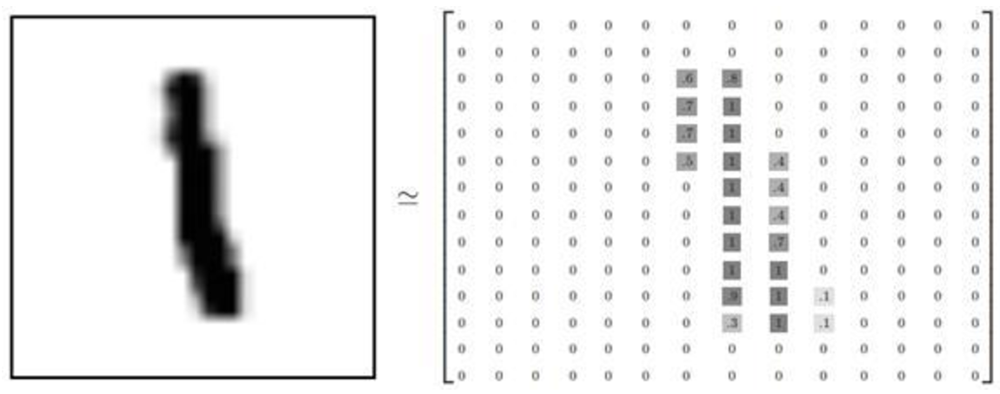

# mnist_tensorflow
homework of MNIST handwritten digits recognition

## Dataset

The MNIST is a well-known database of handwritten digits recognition.
It has 60000 train images and 10000 test images.In MNIST,each image whose
size is 28x28 represents a digit from 0 to 9.

(This picture only show 14x14 matrix for convenience)

